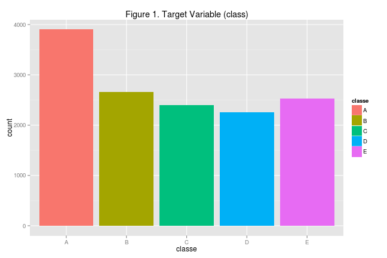
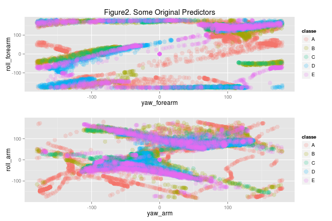
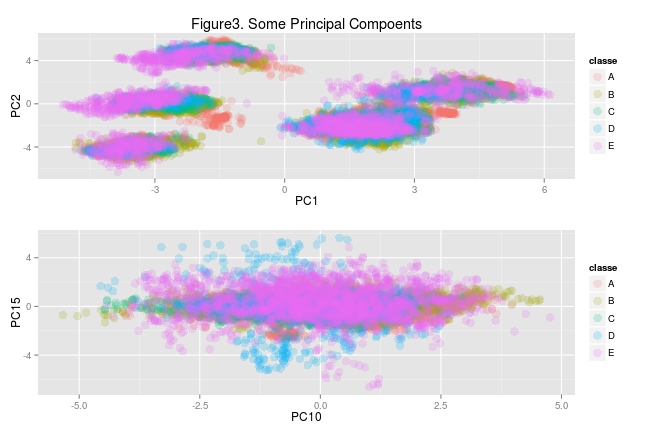

Practical Machine Learning - Course Project
===========================================

## Objectives

We are asked to determine how well individuals perform a weight lifting exercise using human-activity-recognition data captured by accelerometers. 

We need to answer the following questions:  
- how did we built the predictive model: we used random forests  
- how did we handle cross validation: we carved out a validation partition in the data and tested the model aganst it  
- what is the expected out of sample error (will be presented below)  
- what is the rationale for the choices made (will be explained thougout the document)  

## Getting and Cleaning Data

First, we load the two input datasets that we'll use train and test our solution. 

The data was obtained from: Velloso, E.; Bulling, A.; Gellersen, H.; Ugulino, W.; Fuks, H. Qualitative Activity Recognition of Weight Lifting Exercises. Proceedings of 4th International Conference in Cooperation with SIGCHI (Augmented Human '13) . Stuttgart, Germany: ACM SIGCHI, 2013.


```r
training.all <- read.csv("./pml-training.csv", na.strings = c("NA","#DIV/0!"))
testing      <- read.csv("./pml-testing.csv",  na.strings = c("NA","#DIV/0!"))
```

Next, we split the first dataset in two partitions: A "training" partition that we'll use to build models and a "validation" partition to estimate the "out of sample error" of the final model that we select.


```r
#First split:
set.seed(13925)
inTrain    <- createDataPartition(y = training.all$classe, p=0.7, list=FALSE)
validation <- training.all[-inTrain,]
training   <- training.all[inTrain,]
```

We have 160 variables in these datasets but after looking at the contents (not printed due to space) I decided to drop the following variables (rationale explained):
- Variables with missing values in the training set for every record that is not a new window (their values are missing in the testing set)  
- Subject identity (if we keep it as a predictor, the model won't generalize to other subjects)
- Time stamps (could be used for feature extraction but not for model training since the same values won't repeat in future exercises)  
- Start of new window (a periodic timing factor that doesn't seem to be relevant for this prediction)
- Sequential numbers (irrelevant for prediction)


After all these changes to the datasets, here are the number of variables and observations:


```
## training:   13737 53 
## validation: 5885 53 
## testing:    20 53
```


## Exploratory Data Analysis  

Now we should look deeper into the data. First, we'll look at the distribution of the target variable:

 

Next, we'll look at the predictor variables ploted against our target variable and against each other (I am showing only 4 predictors due to space):

 

In this case, we observe patterns that are not simple and not linear. We will need a model that offers a great degree of flexibility such as a random forest. 

In order to reduce the number of predictors while capturing the maximum amount of variability in the data, I will generate the "principal components":


```r
#Set the target and ID variables aside (PC does not apply to them)
predictorVars1  <- !(colnames(training) %in% c('classe'))
predictorVars2  <- !(colnames(testing) %in% c('problem_id'))

#Pre-process the training data
preObj          <- preProcess(training[,predictorVars1], method=c("center", "scale", "pca"), thresh = 0.95)

#Apply the transformation to all datasets
training.prep   <- cbind(classe=training$classe,        predict(preObj, training[,  predictorVars1])); 
validation.prep <- cbind(classe=validation$classe,      predict(preObj, validation[,predictorVars1])); 
testing.prep    <- cbind(problem_id=testing$problem_id, predict(preObj, testing[,   predictorVars2]));
```

Here are some of the principal components plotted against the target variable:


 

Looking at these plots, its not immediately clear to me whether the original variables or the principal components will predict better the target variable. Therefore I will train two models and compare them to each other. 

## Predictive Modeling  

Given that we have a categorical predictor and non-linear relationships, I will chose a random forest model. This model is time consuming but has great predictive power. I will use a number of trees smaller than the default of 500 because, after testing this process a couple of times, I concluded this produces good results.


```r
#Model 1: With original predictors
model1 <- train(classe ~ . , method="rf", data=training, ntree=100)
```

```
## Loading required package: randomForest
## randomForest 4.6-7
## Type rfNews() to see new features/changes/bug fixes.
```


```r
#Model 2: With principal components
model2 <- train(classe ~ . , method="rf", data=training.prep, ntree=100)
```


## Model Comparison

We will apply both models to the validation data and see which one performs better:


```r
cross.validation1 <-predict(model1, newdata=validation)
cross.validation2 <-predict(model2, newdata=validation.prep)
```

These are the cross validation results for Model 1:


```
## Confusion Matrix and Statistics
## 
##           Reference
## Prediction    A    B    C    D    E
##          A 1670    9    0    0    0
##          B    3 1125    4    0    2
##          C    0    4 1017   13    5
##          D    0    1    4  951    8
##          E    1    0    1    0 1067
## 
## Overall Statistics
##                                         
##                Accuracy : 0.991         
##                  95% CI : (0.988, 0.993)
##     No Information Rate : 0.284         
##     P-Value [Acc > NIR] : <2e-16        
##                                         
##                   Kappa : 0.988         
##  Mcnemar's Test P-Value : NA            
## 
## Statistics by Class:
## 
##                      Class: A Class: B Class: C Class: D Class: E
## Sensitivity             0.998    0.988    0.991    0.987    0.986
## Specificity             0.998    0.998    0.995    0.997    1.000
## Pos Pred Value          0.995    0.992    0.979    0.987    0.998
## Neg Pred Value          0.999    0.997    0.998    0.997    0.997
## Prevalence              0.284    0.194    0.174    0.164    0.184
## Detection Rate          0.284    0.191    0.173    0.162    0.181
## Detection Prevalence    0.285    0.193    0.177    0.164    0.182
## Balanced Accuracy       0.998    0.993    0.993    0.992    0.993
```

And here are the cross validation results for Model 2:


```
## Confusion Matrix and Statistics
## 
##           Reference
## Prediction    A    B    C    D    E
##          A 1659   13    3    1    0
##          B    7 1107   12    1    9
##          C    5   18  997   47    9
##          D    2    1    9  915   18
##          E    1    0    5    0 1046
## 
## Overall Statistics
##                                         
##                Accuracy : 0.973         
##                  95% CI : (0.968, 0.977)
##     No Information Rate : 0.284         
##     P-Value [Acc > NIR] : < 2e-16       
##                                         
##                   Kappa : 0.965         
##  Mcnemar's Test P-Value : 6.21e-09      
## 
## Statistics by Class:
## 
##                      Class: A Class: B Class: C Class: D Class: E
## Sensitivity             0.991    0.972    0.972    0.949    0.967
## Specificity             0.996    0.994    0.984    0.994    0.999
## Pos Pred Value          0.990    0.974    0.927    0.968    0.994
## Neg Pred Value          0.996    0.993    0.994    0.990    0.993
## Prevalence              0.284    0.194    0.174    0.164    0.184
## Detection Rate          0.282    0.188    0.169    0.155    0.178
## Detection Prevalence    0.285    0.193    0.183    0.161    0.179
## Balanced Accuracy       0.994    0.983    0.978    0.972    0.983
```


In conclusion, Model 1 (with original predictors) is the best model and the accuracy level reached is 0.9907 which means that the "out of sample"" error can be estimate as 0.9 percent.

Strictly speaking, with a randomforest we don't have a need for cross validation because the model itself produces a good estimate of the  out of sample error but we have plenty of data so i decided to still test it like this. 


## Results  

Now we are ready to score the test data in order to predict the class of each record.


```r
#Score the testing data
results1 <- as.character(predict(model1, newdata=testing))
results2 <- as.character(predict(model2, newdata=testing.prep))

#Save the results in files ready for upload
pml_write_files = function(x, model_dir, model_name){
  n = length(x)
  for(i in 1:n){
    filename = paste0(model_dir,"/",model_name,"problem_id_",i,".txt")
    write.table(x[i],file=filename,quote=FALSE,row.names=FALSE,col.names=FALSE)
  }
}
pml_write_files(results1,"./results","model1_")
pml_write_files(results2,"./results","model2_")

#Print predictions from model 1
results1
```

```
##  [1] "B" "A" "B" "A" "A" "E" "D" "B" "A" "A" "B" "C" "B" "A" "E" "E" "A"
## [18] "B" "B" "B"
```

```r
#Print predictions from model 2
results2
```

```
##  [1] "B" "A" "A" "A" "A" "E" "D" "B" "A" "A" "A" "C" "B" "A" "E" "E" "A"
## [18] "B" "B" "B"
```


